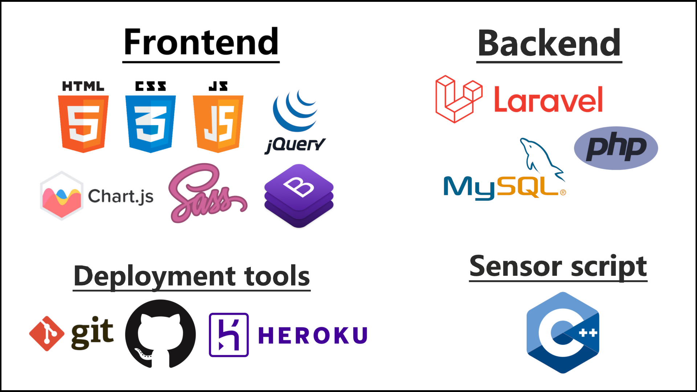

Readme - Weather Tracker
========================
[Hosted web app link](http://home-weather-tracker.herokuapp.com)

* * * * *

## I. Introduction

### The Weather Tracker website provides an app with a simple user interface, to preview our sensors data, to get notifyed if anithing is unusual.

​Figure 1 – The starting page of the app

* * * * *

## II. Used technologies

The web app was created using a lot of different technologies.

Figure 2 – Used FrontEnd, BackEnd, sensor scripting and deployment tools and languages

#### Frontend
- HTML - the app's markup language
- CSS - the app's styling language  
- Sass - to make the CSS more dynamic
- Bootstrap - CSS framework to make the styling more easier   
- JavaScript - frontend programming language
- jQuery - JavaScript library used for AJAX requests to the server
- Chart.js - JavaScript used for the charts

#### Backend
- PHP - backend programming language 
- Laravel framework - PHP framework for making the development more easier 
- MySQL - the app's database languege, database host: [remotemysql.com](https://remotemysql.com)  

#### Deployment tools
- GIT - version control system for syncHronizing the code with GitHub
- GitHub - version control storage, the server serves the files from here. 
- Heroku - the webapp's host [heroku.com](https://heroku.com) 

#### Sensor Script
- C++ - programming language for the sensor script for reading and sending data 

* * * * *

## III. Features:

​Figure 3 – The webapp's features

-   **24/7 Access** - the website can be accessed anytime from any device.
-   **Security** - data security thanks to the secure authentication system.
-   **Data Diversity** - the sensors track the air temperature, humidity and atmospheric pressure.
-   **Grafikonok** - datas can be viewed on descriptive charts.
-   **Live Updates** - the data is always up to date on the website.
-   **Error Bounderies** - set error bounderies and track unusual changes.

* * * * *

## IV. Authentication:

​Figure 4 – The application's registration and login form 

* * * * *

## V. Administrator rights!

1.  **Access all the data**
2.  **Manage the users's sensors**
3.  **Access to the sensor settings and change the owner.**

### V. – 1. Access all the data (Latest Data link)

​Figure 5 – All the data from all the sensor sorted by date with pagination

By clicking on the "View Details" button we can see more details about that particular dataset.

​Figure 6 – Details about the dataset

### V. – 2. Manage the users's sensors (Users link)

​Figure 7 – List of all the users and their number of sensors.

By clicking on the "View" button we can see the selected user's sensors.

### V. – 3. Access to the sensor settings and change the owner (Sensors link)

​Figure 8 – List of all the sensors

By clicking on the "Add Sensors" button we can add more sensors to the system

​Figure 9 – The form for adding a sensor

A "View Details" gombra kattintva pedig a kiválasztott szenzor
beállításait és legutóbbi adatait tekinthetjük meg.

10. ábra – A szenzor beállításai és legutóbbi adatai.

Az "Edit Settings" gombra kattintva a kiválasztott szenzor beállításait
módosíthatjuk.

​11. ábra – A szenzor beállításait módosító űrlap

Az admin itt módosíthatja a szenzor tulajdonosát.

* * * * *

## VI. felhasználói jogok!

1.  **A saját adatok monitorizálása**
2.  **A saját szenzorok bellálításainak módosítása.**
3.  **A saját adatok grafikonos áttekintése**

​12. ábra – A felhasználók által látott oldal belépéskor

### VI. – 1. A saját adatok monitorizálása (Latest Data menüpont)

​13. ábra – A saját adatok kilistázva, mindig a legutolsó adattal
legfelül. Az oldalon lapozni is lehet

A "View Details" gombra kattintva pedig részletesebben megnézhetjük az
adott mérést hasonlóan az adminokhoz.

### VI. – 2. A saját szenzorok bellálításainak módosítása (My Sensors menüpont)

​14. ábra – A saját szenzorok kilistázva

A "View Details" gombra kattintva pedig részletesebben megnézhetjük a
senzor beállításait és onnan pedig az "Edit sensors" menüpont a
beállításokat modosító űrlapra irányít minket.

​15. ábra – A szenzor adatait módosÍtó űrlap.

A felhasználó ternmészetesen nem tudja a szenzor tulajdonosát
módosítani. 
 Megfigyelhető, hogy beállíthatőak határok amik azt jelzik, hogy
számunkra milyen skálán mozgó értékek a megfelelőek. A nem megfelelő
adatok kiemelve jelennek meg. (Lásd. 5. ábra, 6. ábra, 13. ábra) 
 Az itt beállított szín a grafikonon való megjelenéshez szükséges.

### VI. – 3. A saját adatok grafikonos áttekintése (Charts menüpont)

Ennél a menüpontnál kiválaszthatjuk, hogy milyen napi adatokat és ezeket
melyik szenzorainkról szerentnénk látni.

​16. ábra – A grafikonok adatainak módosítását biztosító űrlap

​17. ábra – A hőmérséklet-változást mutató grafikon a kiválasztott napra

Az oldalon tekinthető meg a kiválasztott napi páratartalom- és
légnyomás-változást mutató grafikon is.

## VII. A használt szenzorok adatai 

A wabalkalmazás a BME280-as szenzorral felszerelt NodeMCU ESP8266 WiFi modul küldi az adatokat.  

​18. ábra – A BME280-as senzorral felszerelt WiFi modul 

Az adatok 10 percenként vannak mérve és egy internetes adatbáziba lementve.  

