Readme - Weather Tracker
========================
[Deployed App On Heroku](http://home-weather-tracker.herokuapp.com)

* * * * *

## I. Bevezető

### A Weather Tracker nevű weboldal egy egyszerű és letisztult felhasználói felületet biztosít arra, hogy az általunk birtokolt szenzorok adatait követni tudjuk és értesüljünk esetleges vészhelyezetekről.

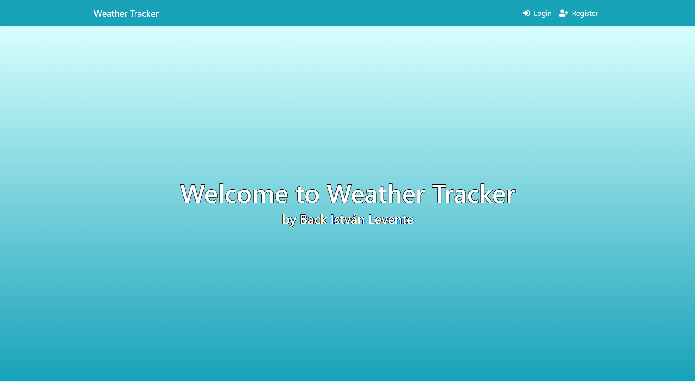

​1. ábra – Az alkalmazás kezdőoldala

* * * * *

## II. Az alkalmazás szolgáltatásai:

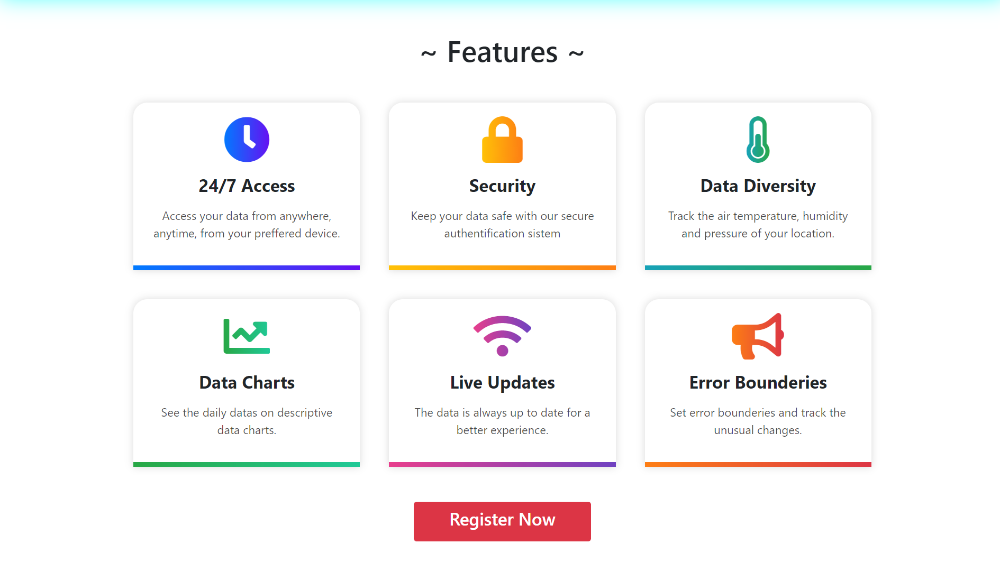

​2. ábra – Az alkalmazás szolgáltatásai

-   **24/7 elérés** - az oldal bármikor, bármilyen eszközről elérhető.
-   **Az adatok védelme** - A saját adataid védve vannak a felhasználói
    azonosításnak köszönhetően.
-   **Változatos adatok** - a szenzorok hőmérsékletet, páratartalnmat és
    légnyomást is mérnek.
-   **Grafikonok** - az adatok látványos grafikonokon is megtakinthetők.
-   **Valós idejű adatok** - ha egy adat bekerül az adatbázisba máris
    elérhetővé válik az oldalon.
-   **Vészhelyzeti értékek** - a beállított határokon kívül eső értékek
    ki vannak emelve.

* * * * *

## III. Az alkalmazás felhasználói azonosítása:

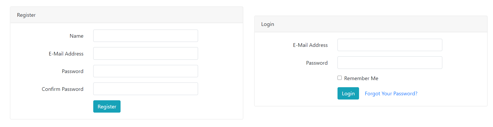

​3. ábra – Az alkalmazás regisztrációs és bejelentkezési űrlapja

* * * * *

## IV. Adminisztrátori jogok!

1.  **Összes adat monitorizálása**
2.  **Felhasználók szenzorainak kezelése**
3.  **Szenzorok bellálításainak és tulajdonosának módosítása.**

### IV. – 1. Összes adat monitorizálása (Latest Data menüpont)
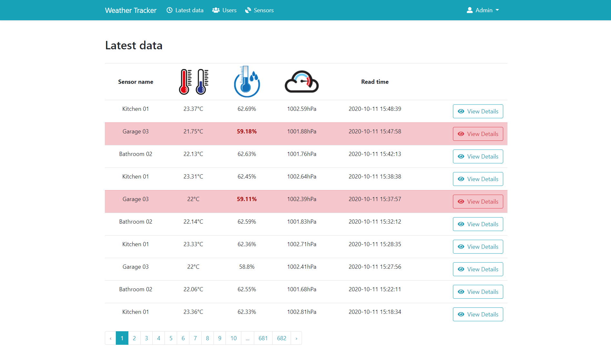

​4. ábra – Az összes szenzor összes adata kilistázva, mindig a legutolsó
adattal legfelül. Az oldalon lapozni is lehet

A "View Details" gombra kattintva pedig részletesebben megnézhetjük az
adott mérést.

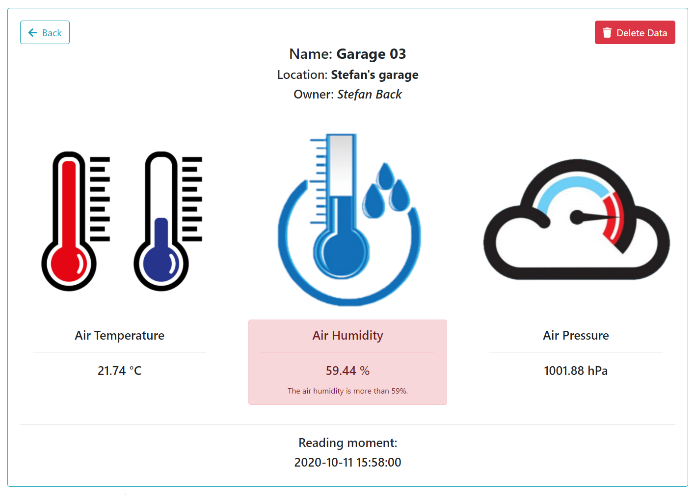

​5. ábra – A mérés részletes áttekintője

### IV. – 2. Felhasználók szenzorainak kezelése (Users menüpont)

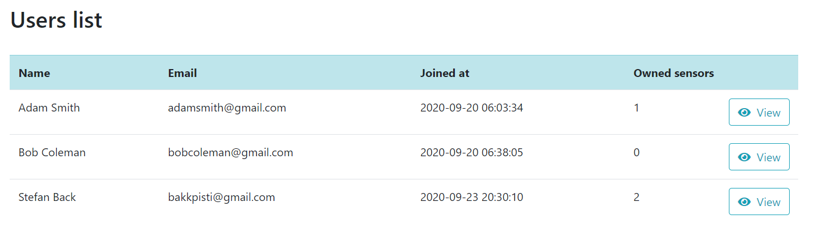

​6. ábra – Az összes felhasználó kilistázva a szenzoraiknak a számával.

A "View" gombra kattintva a kiválasztott felhasználó szenzorait
tekinthetjük meg.

### IV. – 3. Szenzorok bellálításainak és tulajdonosának módosítása (Sensors menüpont)

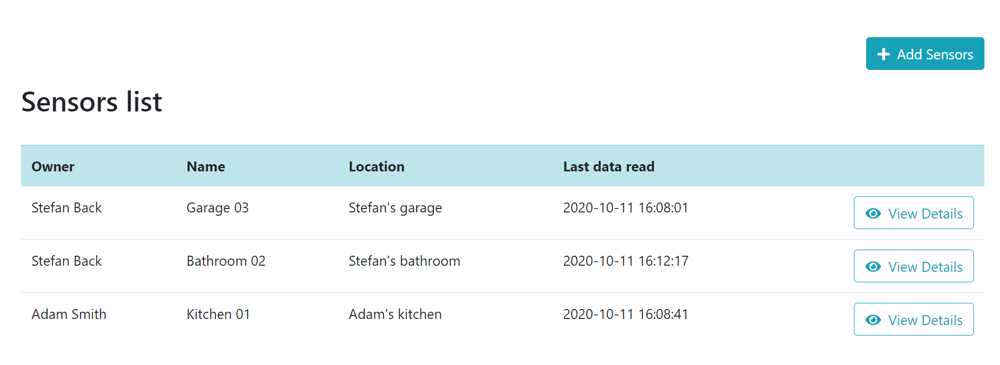

​7. ábra – Az összes szenzor kilistázva

Az "Add Sensors" gombra kattintva új senzort adhatunk hozzá az
adatbázishoz

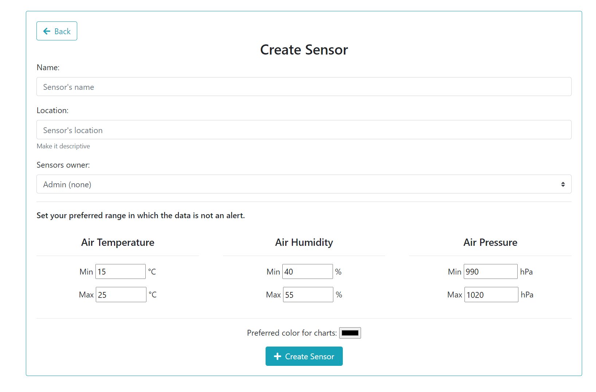

​8. ábra – A szenzor hozzáadásának űrlapja

A "View Details" gombra kattintva pedig a kiválasztott szenzor
beállításait és legutóbbi adatait tekinthetjük meg.

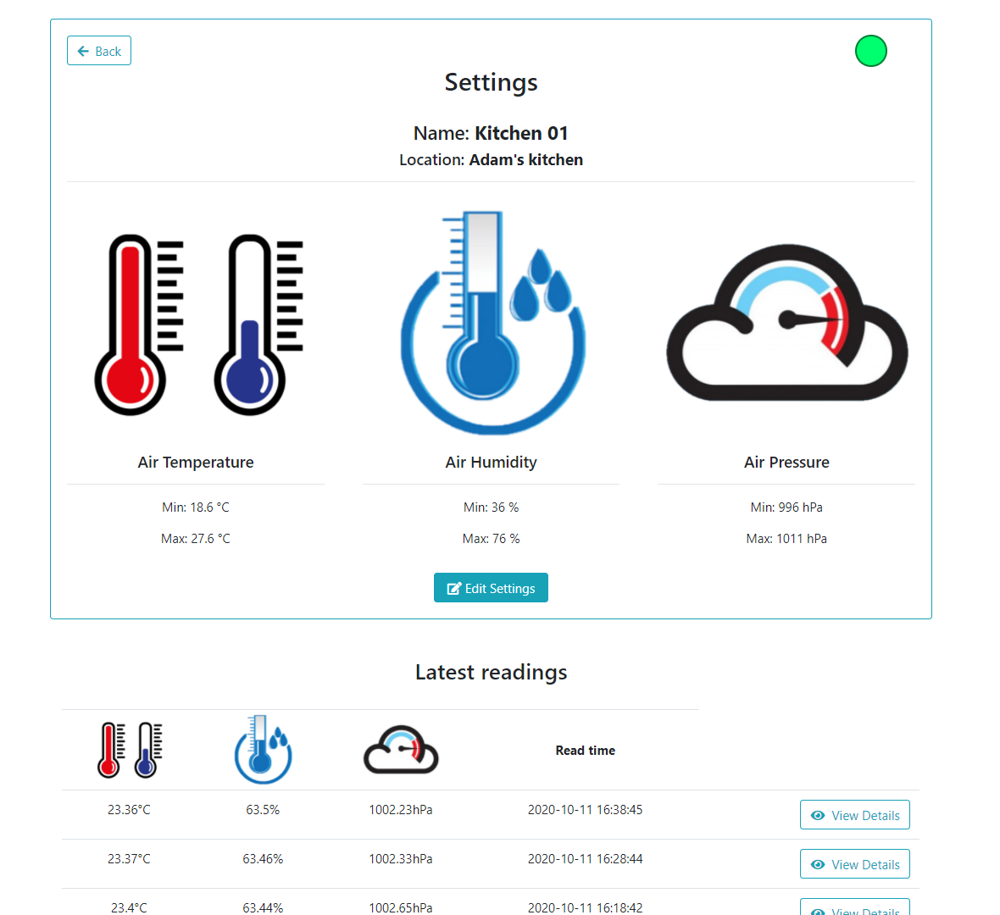

​9. ábra – A szenzor beállításai és legutóbbi adatai.

Az "Edit Settings" gombra kattintva a kiválasztott szenzor beállításait
módosíthatjuk.

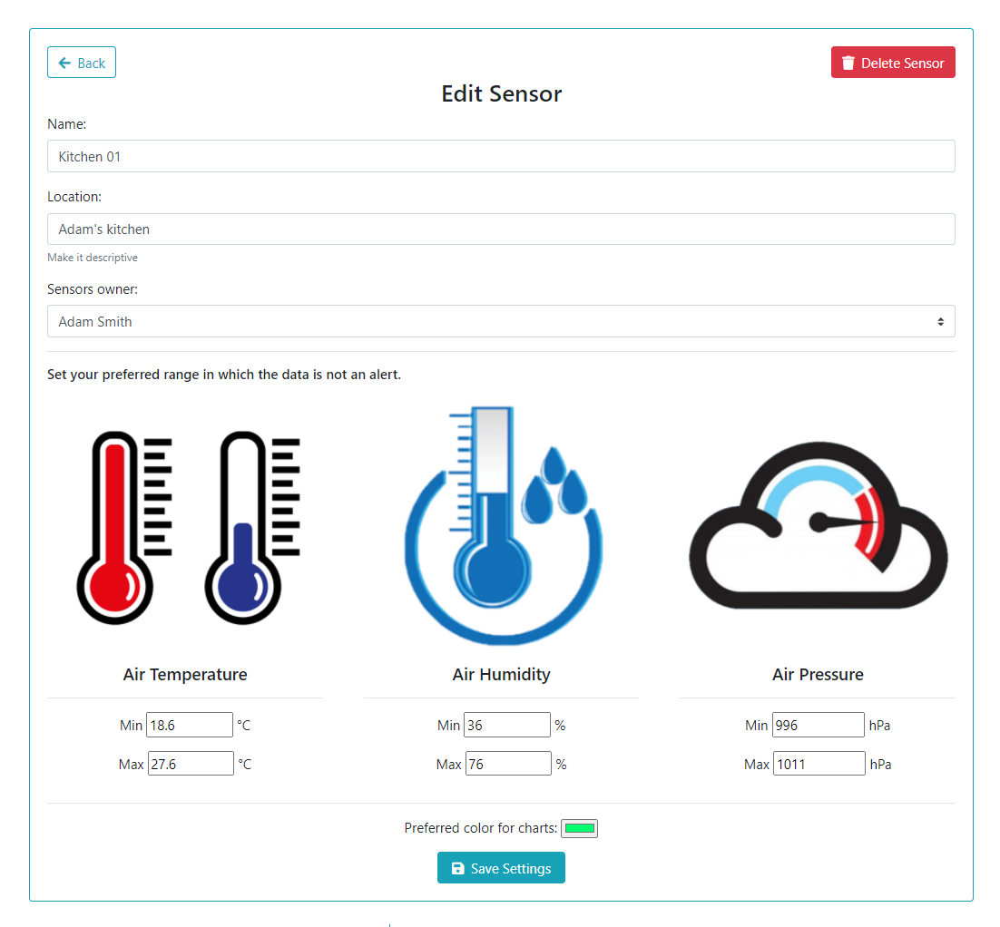

​10. ábra – A szenzor beállításait módosító űrlap

Az admin itt módosíthatja a szenzor tulajdonosát.

* * * * *

## V. felhasználói jogok!

1.  **A saját adatok monitorizálása**
2.  **A saját szenzorok bellálításainak módosítása.**
3.  **A saját adatok grafikonos áttekintése**

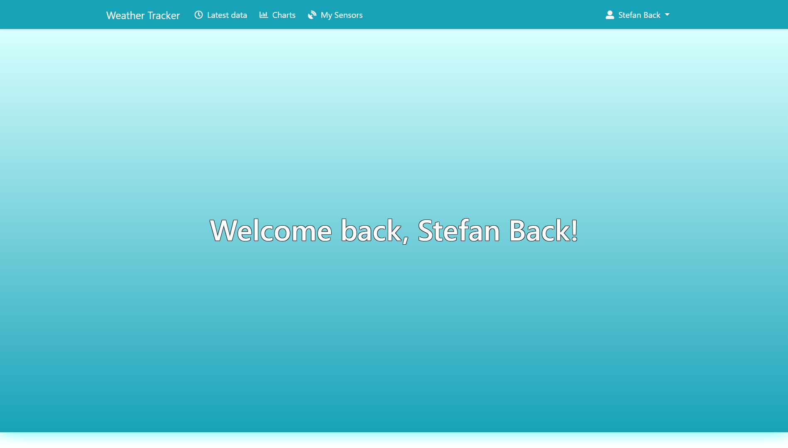

​11. ábra – A felhasználók által látott oldal belépéskor

### V. – 1. A saját adatok monitorizálása (Latest Data menüpont)

​12. ábra – A saját adatok kilistázva, mindig a legutolsó adattal
legfelül. Az oldalon lapozni is lehet

A "View Details" gombra kattintva pedig részletesebben megnézhetjük az
adott mérést hasonlóan az adminokhoz.

### V. – 2. A saját szenzorok bellálításainak módosítása (My Sensors menüpont)

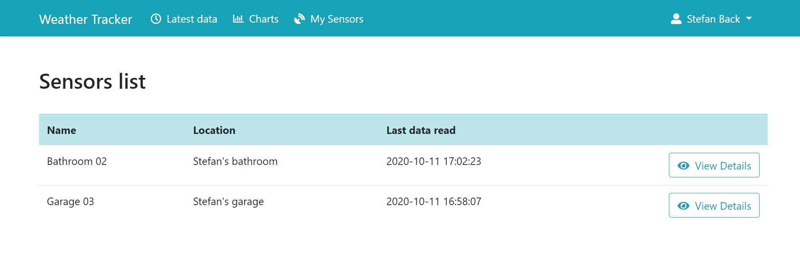

​13. ábra – A saját szenzorok kilistázva

A "View Details" gombra kattintva pedig részletesebben megnézhetjük a
senzor beállításait és onnan pedig az "Edit sensors" menüpont a
beállításokat modosító űrlapra irányít minket.

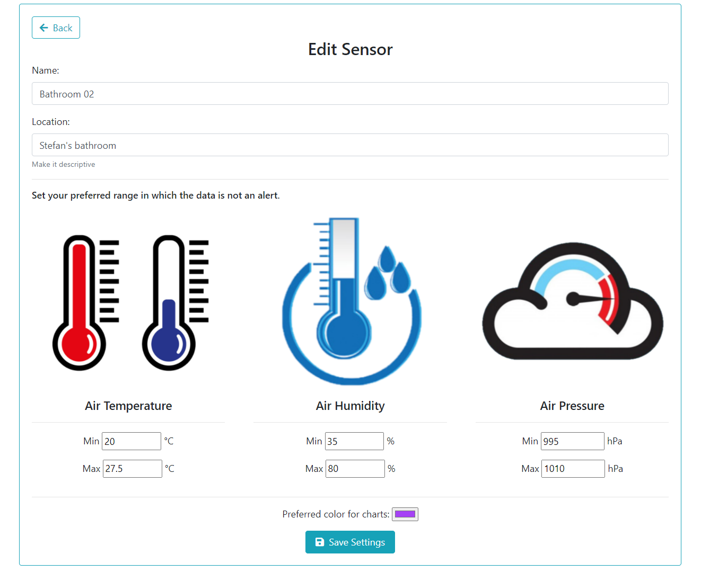

​14. ábra – A szenzor adatait módosÍtó űrlap.

A felhasználó ternmészetesen nem tudja a szenzor tulajdonosát
módosítani. 
 Megfigyelhető, hogy beállíthatőak határok amik azt jelzik, hogy
számunkra milyen skálán mozgó értékek a megfelelőek. A nem megfelelő
adatok kiemelve jelennek meg. (Lásd. 4. ábra, 5. ábra, 12. ábra) \
 Az itt beállított szín a grafikonon való megjelenéshez szükséges.

### V. – 3. A saját adatok grafikonos áttekintése (Charts menüpont)

Ennél a menüpontnál kiválaszthatjuk, hogy milyen napi adatokat és ezeket
melyik szenzorainkról szerentnénk látni.

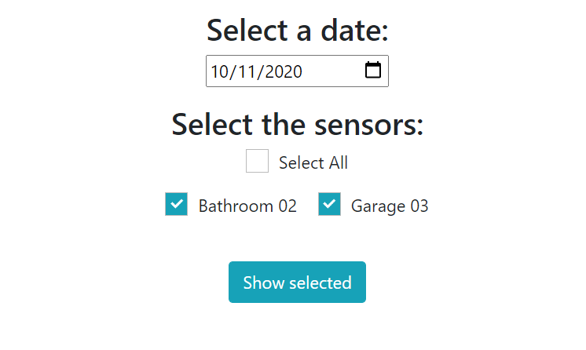

​15. ábra – A grafikonok adatainak módosítását biztosító űrlap

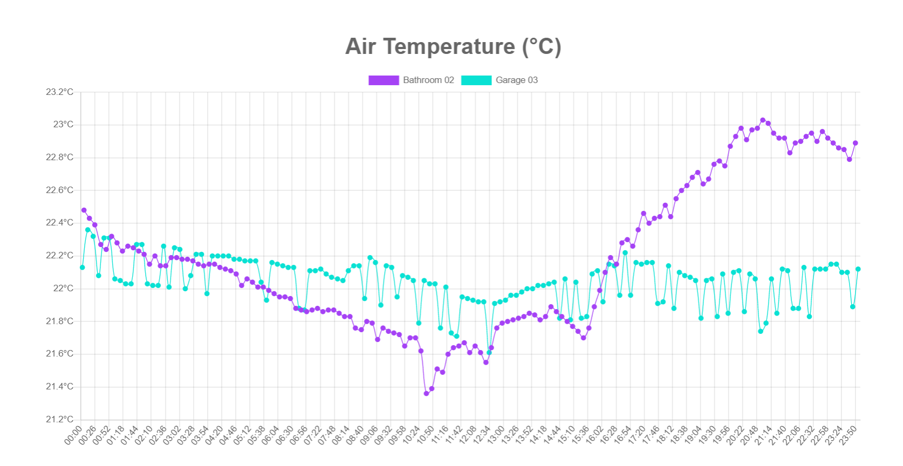

​16. ábra – A hőmérséklet-változást mutató grafikon a kiválasztott napra

Az oldalon tekinthető meg a kiválasztott napi páratartalom- és
légnyomás-változást mutató grafikon is.

## VI. A Szenzorok adatai

A wabalkalmazás a BME280-as szenzorral felszerelt ... 

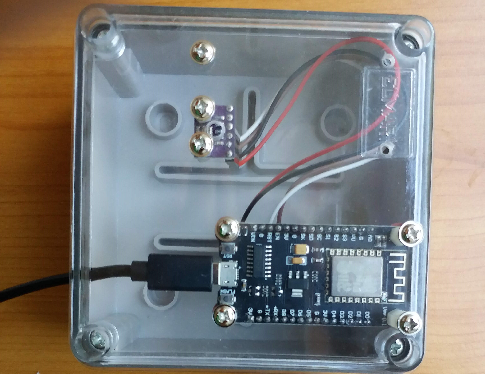

​17. ábra – A BME280-as senzor a ...-al

Az adatok 10 percenként vannak mérve és egy internetes adatbáziba lementve.  